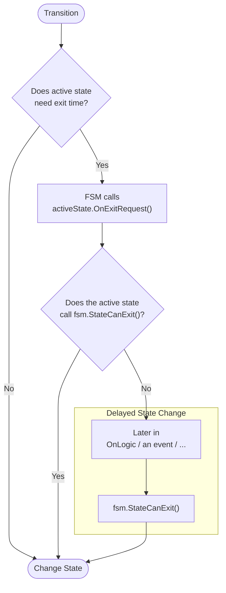
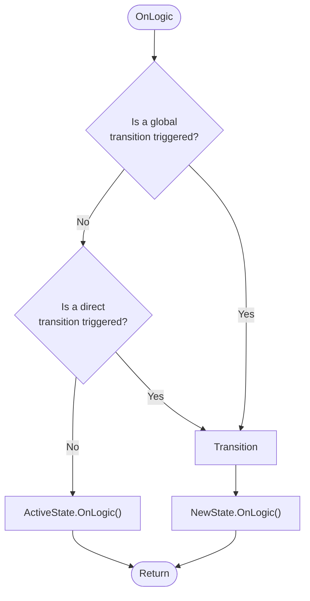

<p align="center">
  <a href="https://github.com/Inspiaaa/UnityHFSM">
    </a>
  <a href="https://github.com/Inspiaaa/UnityHFSM/blob/master/LICENSE.md" alt="GitHub license">
    </a>
  <a href="https://github.com/Inspiaaa/UnityHFSM/releases" alt="GitHub release">
    </a>
  <a href="https://openupm.com/packages/com.inspiaaa.unityhfsm/">
    </a>
</p>

A simple yet powerful **hierarchical finite state machine** for the Unity game engine. It is scalable and customisable by being **class-based**, but also supports functions (lambdas) for **rapid prototyping**.

Thanks to overloading, it minimises boilerplate code while still supporting **generics**.

It has a special focus on the temporal aspects of state transitions, making it ideal for timing and synchronisation sensitive problems.

---

### Why use UnityHFSM?

- State machines are an amazingly easy way to write and organise game logic. (As soon as you have states, e.g. Walk, Run, Sneak, Jump, you can use a state machine)

- It's **easy** and **straightforward** to use

- It helps you **tame complex behaviour** (e.g. weapon handling -> cooling, ammo, reload, fire) or write AI for NPCs

- Helps you write **self documenting code**, that is **maintainable** and **readable**

- **Reduces the boilerplate** code required to write a state machine

- UnityHFSM is **lightweight** and **efficient**, making it perfect for solving small and big problems

- It is **especially designed for Unity**, and supports **coroutines**, which would otherwise be difficult to integrate in a state machine

- **No GC Allocations** for state changes / updates / ... after setting up the state machine (-> No unwanted GC related lag spikes because of the state machine)

- The code is **well documented**

- It is **not a component** (MonoBehaviour) and therefore has a **low overhead**

- By being hierarchical, it can reduce the amount of duplicate code between states

---

**In the wiki:**

- [Full overview over features](https://github.com/Inspiaaa/UnityHFSM/wiki/Feature-Overview)

- [How to use UnityHFSM outside of Unity](https://github.com/Inspiaaa/UnityHFSM/wiki/Using-UnityHFSM-outside-of-Unity)

**Table of contents:**

- [Fast prototyping](#simple-state-machine)

- [Hierarchical features](#hierarchical-state-machine)

- [Timing of state changes](#timing-of-state-changes)

- [Hierarchical timing](#hierarchical-timing)

- [Multiple state change patterns](#state-change-patterns)

- [Control flow of OnLogic](#control-flow-of-onlogic)

- [Unity **coroutines**](#unity-coroutines)

- [Scalable (class-based)](#class-based-architecture)

- [Generics](#generics)

- [Debugging Tips](#debugging-tips)

## Installation

### Unity Package

To get started, download the latest version of UnityHFSM from the [Releases](https://github.com/Inspiaaa/UnityHFSM/releases) page. Simply extract the zip file and put the folder anywhere in your `Assets` folder. Et voilà, you're ready to go!

### UPM Package

<details>
<summary>Add from OpenUPM <em>| via scoped registry</em></summary>

To add OpenUPM to your project:

- Open `Edit/Project Settings/Package Manager`

- Add a new Scoped Registry:
  
  ```
  Name: OpenUPM
  URL:  https://package.openupm.com/
  Scope(s): com.inspiaaa.unityhfsm
  ```

- Click <kbd>Save</kbd>

- Open Package Manager

- Select ``My Registries`` in dropdown top left

- Select ``UnityHFSM`` and click ``Install``
  
  </details>

<details>
<summary>Add from GitHub | <em>no updates through PackMan</em></summary>

You can also add it directly from GitHub on Unity 2019.4+. Note that you won't be able to receive updates through Package Manager this way, you'll have to update manually.

- Open Package Manager (<kbd>Window</kbd> > <kbd>Package Manager</kbd>)
- Click <kbd>+</kbd>
- Select <kbd>Add from Git URL</kbd>
- Paste
  - `https://github.com/Inspiaaa/UnityHFSM.git#upm` for the latest stable release (**recommended**)
  - `https://github.com/Inspiaaa/UnityHFSM.git#release` for the development version
  - `https://github.com/Inspiaaa/UnityHFSM.git#v1.8.0` for a specific version (`v1.8.0` here)
- Click <kbd>Add</kbd>
- Tip: If you're using VSCode, and you're not getting any IntelliSense, you may have to regenerate the `.csproj` project files (<kbd>Edit</kbd> > <kbd>Preferences</kbd> > <kbd>External Tools</kbd> > <kbd>Regenerate project files</kbd>)

</details>

---

## Example

## Simple State Machine

Here's a simple state machine for an enemy spy in a game.


As you can see, the enemy will try to stay outside of the player's viewing range while extracting intel. When the player goes too far away, it will follow the player again.

### The Idea

- **Create the state machine:**
  
  ```csharp
  fsm = new StateMachine();
  ```

- **Add states:** Each state is represented by a `StateBase` object. You can either use one of the built-in state classes (e.g. the `State` class) to define the state's logic or write a custom class that inherits from `StateBase`.
  
  ```csharp
  fsm.AddState(
      name,
      new State(
          onEnter,
          onLogic,
          onExit
      )
  );
  ```

- **Add transitions:** Transitions can be defined using `TransitionBase` objects. They determine when and under which conditions the state machine should switch to another state. As with the states, the simplest option is to use one of the builtin transition types (e.g. the `Transition` class). If you instead choose to create a custom transition class by inheriting from `TransitionBase`, see the [class-based architecture section](#class-based-architecture) for more information.
  
  ```csharp
  fsm.AddTransition( new Transition(
      from,
      to,
      condition
  ));
  ```

- **Initialise the state machine**
  
  ```csharp
  fsm.SetStartState(id);
  fsm.Init();
  ```

- **Run the state machine:**
  
  ```csharp
  void Update() {
      fsm.OnLogic()
  }
  ```

### The Implementation

#### Creating the state machine

```csharp
using System.Collections;
using System.Collections.Generic;
using UnityEngine;
using UnityHFSM;  // Import the required classes for the state machine.

public class EnemyController : MonoBehaviour
{
    private StateMachine fsm;

    public float playerScanningRange = 4f;
    public float ownScanningRange = 6f;

    void Start()
    {
        fsm = new StateMachine();
    }
}
```

#### Adding states

To be able to define the states' logic concisely, we'll need to create some helper methods and properties first. Their implementation is just an example and may differ for your scene setup.

```csharp
Vector2 PlayerPosition => PlayerController.Instance.transform.position;

float DistanceToPlayer => Vector2.Distance(PlayerPosition, transform.position);

void MoveTowardsPlayer(float speed) {
    transform.position = Vector2.MoveTowards(
        transform.position,
        PlayerPosition,
        speed * Time.deltaTime
    );
}
```

Next, we can define the states in the `Start` method:

```csharp
void Start()
{
    fsm = new StateMachine();

    // Empty state without any logic.
    fsm.AddState("ExtractIntel");

    fsm.AddState("FollowPlayer", new State(
        onLogic: state => MoveTowardsPlayer(1)
    ));

    fsm.AddState("FleeFromPlayer", new State(
        onLogic: state => MoveTowardsPlayer(-1)
    ));

    // This configures the entry point of the state machine.
    fsm.SetStartState("FollowPlayer");
}
```

Notice the `fsm.AddState("ExtractIntel")` call. Interestingly, we don't need to pass in a state object here. This is due to one of the many **"shortcut" methods** that UnityHFSM provides. These are meant to reduce the amount of boilerplate code required for common operations, such as adding blank states. The above line is equivalent to writing: 

```csharp
fsm.AddState("ExtractIntel", new StateBase<string>(needsExitTime: false));
```

Furthermore, we can actually shorten the other state definitions even more by using shortcut methods. We can for example write the `FollowPlayer` state in a more concise way:

```csharp
fsm.AddState("FollowPlayer", onLogic: state => MoveTowardsPlayer(1));
```

Although this example is using lambda expressions for the states' logic, you can of course also just pass normal functions.

> **Side note:** To keep things simple, we're using strings for the state identifiers. Just keep in mind that UnityHFSM is not limited to this, as it allows you to use any custom type (e.g. enums) for the state identifiers. See the [generics](#generics) chapter for more information.

#### Adding transitions

```csharp
void Start()
{
    // ...

    fsm.AddTransition(new Transition(
        "ExtractIntel",
        "FollowPlayer",
        transition => DistanceToPlayer > ownScanningRange
    ));

    fsm.AddTransition(new Transition(
        "FollowPlayer",
        "ExtractIntel",
        transition => DistanceToPlayer < ownScanningRange
    ));

    fsm.AddTransition(new Transition(
        "ExtractIntel",
        "FleeFromPlayer",
        transition => DistanceToPlayer < playerScanningRange
    ));

    fsm.AddTransition(new Transition(
        "FleeFromPlayer",
        "ExtractIntel",
        transition => DistanceToPlayer > playerScanningRange
    ));
}
```

Although the above code snippet is definitely functional, you may notice that it seems a bit overly verbose and repetitive. That's because it is. We can do better!

Firstly, as creating transitions with the `Transition` class is so common, there are shortcut methods to minimise the amount of boilerplate code. The first transition is equivalent to writing:

```csharp
fsm.AddTransition("ExtractIntel", "FollowPlayer",
    transition => DistanceToPlayer > ownScanningRange);
```

Secondly, it is a common pattern to define a transition in one direction when a condition is true, and in the other direction when it is false. UnityHFSM provides a special feature to implement this in code: two way transitions. Using a combination of this feature and shortcut methods we can reduce the original code snippet to the following:

```csharp
fsm.AddTwoWayTransition("ExtractIntel", "FollowPlayer",
    transition => DistanceToPlayer > ownScanningRange);

fsm.AddTwoWayTransition("ExtractIntel", "FleeFromPlayer",
    transition => DistanceToPlayer < playerScanningRange);
```

#### Initialising and running the state machine

```csharp
void Start()
{
    // ...

    // Initialises the state machine and must be called before OnLogic() 
    // is called.
    fsm.Init();
}

void Update()
{
    fsm.OnLogic();
}
```

At this point, the basic version of the enemy controller is finished and ready to use :D

By the way, using all of the aforementioned tricks, the entire definition of the state machine can be reduced to remarkably few lines of code:

```csharp
void Start()
{
    fsm = new StateMachine();

    fsm.AddState("ExtractIntel");
    fsm.AddState("FollowPlayer", onLogic: state => MoveTowardsPlayer(1));
    fsm.AddState("FleeFromPlayer", onLogic: state => MoveTowardsPlayer(-1));

    fsm.SetStartState("FollowPlayer");

    fsm.AddTwoWayTransition("ExtractIntel", "FollowPlayer",
        transition => DistanceToPlayer > ownScanningRange);
    fsm.AddTwoWayTransition("ExtractIntel", "FleeFromPlayer",
        transition => DistanceToPlayer < playerScanningRange);

    fsm.Init();
}
```

## Hierarchical State Machine

When dealing with more complex behaviour, it is natural to break the problem down into sub-problems. This approach maps beautifully to state machines. First you define the states and then in a later step you can add the logic and behaviour to them. When designing a state, it can sometimes be useful to draw another state diagram just for it and to think about how you can break down its behaviour. The result of this is a hierarchy of states - a hierarchical state machine.

How can we implement this in UnityHFSM?

Because the `StateMachine` class inherits from `StateBase`, it can be treated as a normal state. This allows for the nesting of state machines together with states. On top of this, UnityHFSM provides additional features to describe the timing / exit conditions for a state machine (more on this later).

### Expanding on the previous example


In the previous example, we left the `Extract Intel` state empty. Let's change this. When extracting intel, the spy should first collect data and then send it, repeating the process once completed.

So that you can see a visual difference, let's make it that the enemy spins when it enters the `Send Data` state, like it's sending the data out in all directions.

### The Idea

- Create a separate state machine for the nested states (States in `Extract Intel`)

- Add the nested states to the new state machine

- Add the new state machine to the main state machine as a normal state

### The Implementation

#### Separate FSM for the ExtractIntel state

```csharp
void Start()
{
    // This is the main state machine.
    fsm = new StateMachine();

    // This is the nested state machine.
    var extractIntel = new StateMachine();
    fsm.AddState("ExtractIntel", extractIntel);

    // ...
}
```

#### Adding States and Transitions

We want the enemy to stay in the `CollectData` and in the `SendData` state for 5 seconds each. There are a few ways we can implement this.

One option would be to use the built-in `TransitionAfter` class to define a transition that only activates after a certain delay. Using it would look like this:

```csharp
extractIntel.AddTransition(new TransitionAfter("CollectData", "SendData", 5));
```

Another option could be to use UnityHFSM's timing features. We can add transitions that do not have a condition and should therefore make the state machine instantly advance to the next state. At the same time, we declare that the `CollectData` and `SendData` states require "exit time", meaning that the transitions should only occur once the active state is ready and can cleanly exit. See the code snippet below and the next section for more details.

```csharp
void RotateAtSpeed(float speed)
    => transform.eulerAngles += new Vector3(0, 0, speed * Time.deltaTime);

void Start()
{
    fsm = new StateMachine();

    var extractIntel = new StateMachine();
    fsm.AddState("ExtractIntel", extractIntel);

    extractIntel.AddState("SendData",
        onLogic: state => {
            // When the state has been active for more than 5 seconds,
            // notify the fsm that the state can cleanly exit.
            if (state.timer.Elapsed > 5)
                state.fsm.StateCanExit();

            // Make the enemy turn at 100 degrees per second.
            RotateAtSpeed(100f);
        },
        // This means the state won't instantly exit when a transition should
        // happen but instead the state machine waits until it is given permission
        // to change state.
        needsExitTime: true
    );

    extractIntel.AddState("CollectData",
        // The canExit function is another way to define when the state is
        // allowed to exit (it calls `fsm.StateCanExit()` internally).
        canExit: state => state.timer.Elapsed > 5,
        needsExitTime: true
    );

    extractIntel.SetStartState("CollectData");

    // A transition without a condition.
    extractIntel.AddTransition("SendData", "CollectData");
    extractIntel.AddTransition("CollectData", "SendData");

    // ...
}
```

## Timing of State Changes

The timing of state changes is controlled by the active state's `needsExitTime` property.

When `needsExitTime = false`, the state can exit at any point in time, e.g. because of a transition, regardless of its current internal state.

When `needsExitTime = true`, this cannot happen. It indicates to the state machine, that it may need more time before it is ready to exit. Any transition that should happen is delayed and becomes the "pending transition". This is very useful when you do not want an action to be interrupted before it has ended, like in the above case. (This can be skipped / overridden by forcing a transition using `forceInstantly = true`).

But when is the right time for the state machine to finally change states? This is where the `fsm.StateCanExit()` method comes. Calling `fsm.StateCanExit()` notifies the state machine that the state can cleanly exit. If a transition is pending, it will be executed.

Here's what happens in the general case when a transition should happen:

1. The state machine calls `activeState.OnExitRequest()`. If the state can exit, it should call `fsm.StateCanExit()`.

2. If the state couldn't exit when `OnExitRequest()` was called, the active state has to notify the state machine at a later point in time that it can exit by calling the `fsm.StateCanExit()` method. This can e.g. happen in an `OnLogic` call or when an event is triggered.



Another quality of life feature is the `canExit` property of the `State` class. It allows you to write in a declarative way when the state is ready to exit. Internally, the passed `canExit` function is called on each exit request and on each logic call if a transition is pending. If it returns true, it calls `fsm.StateCanExit()`.  In the above example, the `SendData` code could look like this using this feature:

```csharp
extractIntel.AddState("SendData",
    onLogic: state => RotateAtSpeed(100f),
    canExit: state => state.timer.Elapsed > 5,
    needsExitTime: true
);
```

## Hierarchical Timing

> Warning: This is one of the most advanced and complex features of UnityHFSM. The other chapters are easier to follow.

### The Idea

Although the `CollectData` and `SendData` states both have their `needsExitTime` properties set to true, the state machine will instantly exit them, if the player moves too close or too far away. After all, nested state machine that holds these two states does not have its own `needsExitTime` property set to true.

To fix this, we can simply set `needsExitTime = true` in the `ExtractIntel` state machine. This however raises another question: When is the nested state machine allowed to exit? And how can we indicate that it is allowed to exit?

The answer is by using **exit transitions**. These are special transitions that are only checked, when the parent state machine has a pending transition - in other words: when the parent state machine wants the nested state machine to exit. When the transition succeeds, the nested state machine exits so that the parent state machine can transition to its next state. To be exact, the nested state machine only exits when an exit transition succeeds *and* its currently active state is ready to exit (which is always true when `needsExitTime = false`, otherwise when `StateCanExit()` is called).

Let's use this feature in our example. Here's what we'll be doing: 

- While collecting data, the spy should be able to exit the `ExtractIntel` state at any time. This can be achieved by adding an exit transition from `ExtractIntel`. 

- Once all the data has been collected, it should send it out, regardless of where the player is. It does not matter if the player is too far away, as the data has already been collected. To keep it simple, let's make it that the enemy also tries to finish the sending phase, even if it risks being discovered by the player by getting to close.


### The Implementation

Firstly, we'll edit the `Start` method so that the nested state machine has `needsExitTime` set to true:

```csharp
var extractIntel = new StateMachine(needsExitTime: true);
```

Secondly, the state machine should be able to exit `CollectData` at any time, meaning that its `needsExitTime` should be set to false. This means that we'll also need to use a `TransitionAfter` transition later.

```csharp
extractIntel.AddState("CollectData");  // needsExitTime = false by default
```

Finally, we also have to add the transitions. The `SendData --> CollectData` transition can stay the same. As `CollectData` can instantly exit now (`needsExitTime = false`), but we only want to transition to `SendData` after 5 seconds, we'll have to use a `TransitionAfter` transition. Furthermore, we have to add the exit transition.

```csharp
extractIntel.AddTransition("SendData", "CollectData");

// Exit transition without a condition.
extractIntel.AddExitTransition("CollectData");

extractIntel.AddTransition(new TransitionAfter("CollectData", "SendData", 5));
```

In the above code snippet, there are two important things to note:

- The line adding the exit transition uses a shortcut method. It's roughly the same as writing: 
  
  ```csharp
  extractIntel.AddExitTransition(new Transition("CollectData", ""));
  ```
  
  We don't need to define a condition, as it won't be checked unless the main state machine is trying to transition from `ExtractIntel` to another state.

- The order of the transitions matters. Transitions that are added first, are also checked first and therefor have a higher precedence. In this case, we want to prioritise exit transition over the normal transition to the `SendData` state, hence it is added first.

> **Tip:** When debugging a complex hierarchical state machine, it can be really handy to know not only which state is active in the root state machine (using `fsm.ActiveStateName`) but also which states are active in nested state machines.
> 
> That's why UnityHFSM has a feature to do just this:
> 
> ```csharp
> print(fsm.GetActiveHierarchyPath());
> ```
> 
> Example output: `/ExtractIntel/CollectData`.
> 
> Then you can use this on each `Update()` call to debug the state machine.

How could we change the code so that the enemy spy aborts sending the data when the player gets too close? This means that we would want to instantly exit the `ExtractIntel` state and go to the `FleeFromPlayer` state. This requires us to override the `needsExitTime` property of `ExtractIntel` by marking its outbound transition to `FleeFromPlayer` as a forced transition with `forceInstantly = true`.

```csharp
fsm.AddTwoWayTransition("ExtractIntel", "FleeFromPlayer",
    transition => DistanceToPlayer < playerScanningRange,
    forceInstantly: true);
```

To keep it simple, the transitions between `ExtractIntel` and `FleeFromPlayer` are forced in both directions (because we're using a two way transition). In our example it does not make any difference. However, if you wanted to only force it in one direction, you could simply create two separate transitions.

## State Change Patterns

The state machine supports three ways of changing states:

1. Using `Transition` objects as described earlier. You can even have multiple transitions that connect the same two states. They are checked on every `OnLogic` call and can be seen as a type of **polling**.
   
   ```csharp
   fsm.AddTransition(
       new Transition(
           from,
           to,
           condition
       )
   );
   ```

2. Calling the `RequestStateChange` method: Instead of using `Transition` objects to manage state changes, each state can individually also manage its own transitions by **directly** calling the `RequestStateChange` method.
   
   ```csharp
   fsm.RequestStateChange(state, forceInstantly: false);
   ```
   
   **Example**
   
   ```csharp
   fsm.AddState("FollowPlayer", new State(
       onLogic: (state) =>
       {
           MoveTowardsPlayer(1);
   
           if (DistanceToPlayer() < ownScanningRange)
           {
               fsm.RequestStateChange("ExtractIntel");
           }
       }
   ));
   ```

3. Using "Trigger Transitions": These are normal transitions that are only checked when a certain trigger (an event) is activated.
   
   These are really handy when a polling-based solution does not fit or is not efficient enough. Trigger Transitions let you effortlessly leverage the efficiency of **event-based** transitions, in combination with the full power of the existing high-level transition types.
   
   ```csharp
   fsm.AddTriggerTransition(triggerName, transition);
   ```
   
   **Example**
   
   ```csharp
   // Flappy Bird Example
   fsm.AddTriggerTransition(
       "OnCollision",
       new Transition("Alive", "Dead")
   );
   
   // Later
   fsm.Trigger("OnCollision");
   ```

Therefore, UnityHFSM supports **both polling-based and event-based** transitions, as well as the feature to bypass the concept of transitions all together. That's pretty cool.

There is also a slight variation of the `Transition` state change behaviour, that allows you to change to a specific state **from any** other state (a "global" transition as opposed to a "local" / "direct" transition). They have the same `forceInstantly` / `needsExitTime` handling as normal transitions.

```csharp
fsm.AddTransitionFromAny( new Transition(
    from,
    to,
    condition
));

// For Trigger Transitions
fsm.AddTriggerTransitionFromAny(
    triggerName,
    transition
);
```

**Example**

```csharp
fsm.AddTransitionFromAny( new Transition(
    "",    // From can be left empty, as it has no meaning in this context
    "Dead",
    t => (health <= 0)
));

// For Trigger Transitions
fsm.AddTriggerTransitionFromAny(
    "OnDamage",
    new Transition("", "Dead", t => (health <= 0))
);
```

## Control Flow of OnLogic

Every StateMachine's `OnLogic` method manages the automatic transitions via `Transition` (`TransitionBase`) objects and the active state's logic function.

Here's what happens:

1. The state machine checks all global transitions (transitions from any state) and sees if a transition should occur. If this is the case, the state machine will advance to the new state, and call the new state's `OnLogic` function.

2. If this is not the case, the fsm checks all direct transitions (transitions that go directly from the active state to another state) and sees if a transition should occur. If this is the case, the state machine will move on to the new state, and call the new state's `OnLogic` function.

3. If this is not the case, the fsm will finally call the currently active state's `OnLogic` function.

Because global transitions are checked first, they have the highest priority. The reason for this design decision can be illustrated with the following example: When the health of the player drops below 0, regardless of which state the fsm is in, it should transition to the `Dead` state.

As you can see on the steps mentioned above, only one transition can occur per `OnLogic` call. This has many reasons, one of which being that the state machine does not get stuck in an infinite loop.



There is however a way to perform multiple transitions in one `OnLogic` call: As soon as the state machine enters a state that is marked as a **"ghost state"**, it will instantly try all of its outbound transitions. If any one succeeds, it will instantly transition to the next state.

Example:

```csharp
fsm.AddState("A");
fsm.AddState("B", new State(isGhostState: true));
fsm.AddState("C");

fsm.AddTriggerTransition("Event", "A", "B");
fsm.AddTransition("B", "C");
```

At a later point, when `Event` is triggered, the state machine will exit `A`, enter `B`, exit `B`, enter `C` and finally call the `OnLogic` method of `C`:

```csharp
fsm.Trigger("Event");
```

## Unity Coroutines

By using the `CoState` class you can run coroutines. This class handles the following things automatically:

- Starting the coroutine

- Optional: Running the coroutine again once it has completed

- Terminating the coroutine when the state exits

As a result of a [limitation of the C# language](https://stackoverflow.com/questions/35473442/yield-return-in-the-lambda-expression), you can sadly not use lambda expressions to define IEnumerators (=> coroutines).

Here's how we could use it in our example: We can replace the `SendData` state with a more advanced one, which makes the spy turn in one direction for two seconds, and then in the other direction for the same duration.

```csharp
IEnumerator SendData() 
{
    var timer = new Timer();

    while (timer.Elapsed < 2)
    {
        RotateAtSpeed(100f);
        // Wait until the next frame.
        yield return null;
    }

    while (timer.Elapsed < 4)
    {
        RotateAtSpeed(-100f);
        yield return null;
    }

    // Because needsExitTime is true, we have to tell the FSM when it can
    // safely exit the state.
    fsm.StateCanExit();
}

void Start()
{
    // ...

    extractIntel.AddState("SendData", new CoState(
        this,   // Pass in the MonoBehaviour that should run the coroutine.
        SendData,
        loop: true,  // Repeat the coroutine once finished.
        needsExitTime: true
    ));

    // ...
}
```

The `CoState` class also allows you to pass in an iterator function that takes the `CoState` as a parameter. One of the side effects of the way the UnityHFSM is internally implemented regarding its inheritance hierarchy and its support for generics, is that the function has to take the state as a `CoState<string, string>` object and not simply as `CoState`:

```csharp
IEnumerator SendData(CoState<string, string> state)
{
    // ...
}
```

> **Tip:** When designing your state machine, it can sometimes be difficult to decide when to use a nested state machine and when to use a coroutine via `CoState`. Although both can usually achieve the desired outcome, one may be a lot simpler to implement than the other. As a rule of thumb, use a coroutine if you notice that your state diagram resembles a flowchart, otherwise use a hierarchical state machine.

## Custom Events

By default, UnityHFSM uses three main events:
- On Enter: The state machine has switched to this state.
- On Logic: The state machine checks the polling-based transitions and updates the active state.
- On Exit: The state machine has switched to another state.

In Unity, having one update function (on logic) is often not enough, as we sometimes want to run code in the `FixedUpdate` or `LateUpdate` calls. In UnityHFSM we can add such custom events to the state machine via the **action system**. For more information and usage instructions you can check out the complete [feature overview wiki page](https://github.com/Inspiaaa/UnityHFSM/wiki).

## Class-Based Architecture

UnityHFSM is fundamentally designed in an object-oriented manner which allows you to easily create custom state and transition types. By simply inheriting from the common base classes (`StateBase`, `TransitionBase`), custom states and transitions can be developed. This is also how the built-in state and transition types, such as `CoState` and `TransitionAfter`, have been implemented internally.

Here's an overview over the methods you can override:

**Creating custom states**

```csharp
class CustomState : StateBase
{
    public CustomState()
        : base(needsExitTime: false, isGhostState: false) { }

    public override void Init() { }

    public override void OnEnter() { }
    public override void OnLogic() { }
    public override void OnExit() { }

    public override void OnExitRequest() { }
}
```

**Creating custom transitions**

```csharp
class CustomTransition : TransitionBase
{
    public CustomTransition(string from, string to)
        : base(from, to, forceInstantly: false) { }

    public override bool ShouldTransition() { return true; }

    public override void Init() { }

    public override void BeforeTransition() { }
    public override void AfterTransition() { }
}
```

When developing custom state and transition classes, it's also worth understanding how UnityHFSM handles generics (see below) and how the inheritance hierarchy is structured (see the [wiki](https://github.com/Inspiaaa/UnityHFSM/wiki/State-Classes)), so that you can support custom actions (events) in your classes.

## Generics

UnityHFSM also provides first-class support for generics. This means that if you do not want to use  strings for the state identifiers and the events, you can easily use a different datatype, e.g. `int`, enums, custom classes, even booleans...

Advantages of using types other than string:

- It can improve the **safety** of your state machine as it can prevent the issue of typos in the string state names leading to errors. Using enums can ensure that the state identifiers are checked at compile-time.

- It can offer a better mapping to different kinds of problems, e.g. using `int` events for HTTP response status codes instead of strings.

- It can greatly **improve the base performance** of state machines. Using ints or enums as the state identifiers can speed up the internal mechanics by up to 50% depending on the use case. 
  
  > **Side note:** UnityHFSM is already highly optimised and in most cases the time spent in the user's code far outweighs the internal time spent performing transitions / update calls in the state machine. However, in the rare case where reducing the execution time by a few nanoseconds makes a difference, you can use ints or enums to reduce UnityHFSM's overhead to a minimum.

Every nested state machine can use its own type for the state identifiers (`TStateId`). The only thing that all state machines in a given hierarchy have to share, is the type for the triggers / events (`TEvent`), so that they can be passed down the hierarchy.

To realise this, the `StateMachine` class takes 3 generic type parameters: `TOwnId`, `TStateId` and  `TEvent`. `TStateId` is the type for the state names in a state machine, i.e. of its child states. If you use a state machine as a state (-> it would be a nested state machine), it itself needs an identifier for the parent state machine. This is the `TOwnId` type parameter. Lastly `TEvent` is the type for the triggers and events. The order of the parameters is: `StateMachine<TOwnId, TStateId, TEvent>`.

There are also multiple overloads for the `StateMachine` class that reduce the boilerplate code needed to get started:

- `StateMachine` = `StateMachine<string, string, string>`

- `StateMachine<TStateId>` = `StateMachine<TStateId, TStateId, string>`

- `StateMachine<TStateId, TEvent>` = `StateMachine<TStateId, TStateId, TEvent>`

Here's a small example that shows how you can mix different types:

```csharp
enum PlayerStates {
    IDLE, MOVE, JUMP
}

enum MoveStates {
    WALK, DASH
}

enum Events {
    ON_DAMAGE, ON_WIN
}
```

```csharp
var fsm = new StateMachine<PlayerStates, Events>();
var moveFsm = new StateMachine<PlayerStates, MoveStates, Events>();
var idleFsm = new StateMachine<PlayerStates, string, Events>();

fsm.AddState(PlayerStates.IDLE, idleFsm);
fsm.AddState(PlayerStates.MOVE, moveFsm);
fsm.AddState(PlayerStates.JUMP, new State<PlayerStates, Events>());
// Or simply using shortcut methods: fsm.AddState(PlayerStates.JUMP);

moveFsm.AddState(MoveStates.WALK);
moveFsm.AddState(MoveStates.DASH);
moveFsm.AddTransition(new Transition<MoveStates>(MoveStates.WALK, MoveStates.DASH));
// Or simply: fsm.AddTransition(MoveStates.WALK, MoveStates.DASH);

idleFsm.AddState("Animation 1", new State<string, Events>());
idleFsm.AddState("Animation 2");

// ...
```

### A Short Note on Performance

UnityHFSM is engineered with both power and performance in mind. It’s designed to deliver robust functionality without compromising on efficiency, making it an **ideal choice for both small and complex projects** in Unity.

The source code has been carefully benchmarked and optimised to maintain consistent performance across a wide range of use cases.

It follows a "pay only for what you use" design philosophy, both in terms of **memory and performance**. That means that supporting more features does not come at the price of performance. For example, thanks to **lazy initialisation**, UnityHFSM remains extremely lightweight for smaller scenarios, when less features are used. At the same time, its scalable architecture and advanced features are fully capable of handling the demands of larger, more complex projects efficiently.

## Debugging Tips

Here are a couple of tips and tricks you can use to debug complex state machines:

- **Error messages**: When UnityHFSM detects a problem, it throws an exception with a detailed error message that can help you pinpoint the problem and find a solution.
  - Usually, the **first error** that is thrown is the most important one, as the following ones are most likely a just a consequence of the first error.
  - As the error messages span multiple lines, you have to **click on the error** in the console in the Unity Editor in order to see the full message.

  **Example error message:**
  ```
  StateMachineException: 
  In state machine 'Root/Fight'
  Context: Switching states
  Problem: The state "Wait" has not been defined yet / doesn't exist.
  Solution: 
  1. Check that there are no typos in the state names and transition from and to names
  2. Add this state before calling Init / OnEnter / OnLogic / RequestStateChange / ...
  ```

  It explains where this error occurred (in the `Fight` child state machine), what went wrong (target state of the transition was not found), and possible solutions.

- When a hierarchical state machine is not behaving as expected, you can call the `GetActiveHierarchyPath()` method on the root state machine and print its result to the console. It tells you **which states are currently active** within a hierarchical state machine:

  ```csharp
  print(fsm.GetActiveHierarchyPath());  // e.g. "/ExtractIntel/CollectData"
  ```

- Alternatively, if you prefer a more **visual approach**, you can use the **animator graph** feature. It creates an `AnimatorController` in the Unity Editor that lets you understand the structure of a state hierarchy visually. At the same time, it can show you in real-time which state the state machine is currently in.

  

  You can find a tutorial on this topic in the [wiki](https://github.com/Inspiaaa/UnityHFSM/wiki/Visualising-State-Machines-with-Animator-Graphs).

- If you are working on more advanced code and want to produce accurate information regarding the path to the current state **from within the state itself**, without having access to the root state machine, you can use the inspection-related code. The `UnityHFSM.Inspection` namespace is the foundation for dynamic tools like the animator graph feature, but can also be used for debugging (it's what is used for the built-in error messages). In particular, the `StateMachineWalker` class could be of interest:

  ```csharp
  print(StateMachineWalker.GetStringPathOfState(this.fsm));  
  // Prints the path to the current state.
  // E.g. "Root/Fight/Hit"
  ```

# Development

If you want to develop new code for UnityHFSM or contribute to the project, you can take a look at the [development wiki page](https://github.com/Inspiaaa/UnityHFSM/wiki/Development). It gives you a brief introduction to the project file structure and a short guide on how to run the unit tests.

---

For more documentation check out the [Wiki](https://github.com/Inspiaaa/UnityHFSM/wiki).
